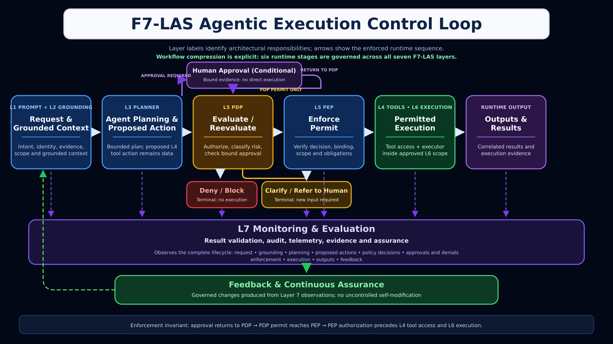

# F7-LAS Architecture Diagrams

These diagrams describe the F7-LAS responsibility model and governed execution
flow. They are architecture views, not evidence that every depicted control is
implemented by this repository. The only executable path currently supported
is the bounded synthetic workflow documented under
[`examples/canonical-workflow/`](../examples/canonical-workflow/README.md).

## Executive control loop

This view summarizes the governance path for an executive audience: mission
context, an action proposal, policy decision, conditional human approval,
enforcement, scoped execution, validation, monitoring, and governed feedback.
An approval-required outcome returns to the PDP for reevaluation. Only a PDP
permit may proceed to PEP enforcement, and PEP authorization occurs before tool
access or execution. Deny/block and clarify/refer-to-human are distinct terminal
outcomes.

## Layer-specific execution control loop

This view maps the same control loop to F7-LAS Layers 1–7. Layer numbers name
responsibility domains; they do not require every runtime event to occur in
numeric order. In particular, Layer 4 first defines a proposed tool action as
data before Layer 5 authorization. Actual Layer 4 tool access may occur only
after permit and successful PEP enforcement, within the applicable Layer 6
execution boundary. Human approval never bypasses the PDP or PEP.

## Canonical implementation alignment

| Diagram concept | Canonical repository behavior |
|---|---|
| Mission request and context | `request` and `context` records establish the fixed mission, actor, evidence, and lab scope. |
| Agent Planning and action proposal | A deterministic `plan` produces one `proposed_action`; the proposal has no authority to execute. No LLM or private chain-of-thought is used or recorded. |
| Policy decision point | OPA evaluates the complete action, scope, approval binding, execution time, and policy-bundle digest, then permits or denies fail closed. |
| Conditional human approval | The canonical fixture creates deterministic synthetic approval evidence before the `policy_decision` record. It demonstrates binding and expiry enforcement, not an interactive approval service or verified human identity. |
| PEP enforcement | Only a PDP permit reaches the PEP. The PEP verifies the decision and its action, approval, scope, policy, obligation, and expiry bindings before authorizing access. |
| Scoped execution and tool access | Only after PEP authorization does the permit path enter the Layer 6 boundary and invoke one registered, synthetic, read-only in-process executor. It makes no network or external API call and independently rechecks the complete binding. |
| Validation, monitoring, and evaluation | `execution_result` and `audit_event` records preserve the outcome; evidence verification and deterministic replay check their correlations and digests. This is not production telemetry or continuous monitoring. |
| Feedback and continuous assurance | Test, review, policy, prompt, and process changes use the normal governed repository workflow. The implementation does not self-modify. |

The permit flow is therefore:

1. admit a request and context;
2. create a bounded plan and proposed Layer 4 action;
3. bind any required approval to the exact request, action, scope, policy, authority, and validity window;
4. obtain or reevaluate a Layer 5 PDP decision, returning any human approval to the PDP;
5. on PDP permit only, enforce the complete authorization at the PEP;
6. after PEP authorization, enter the Layer 6 boundary and perform the registered synthetic action;
7. emit correlated Layer 7 result and audit evidence.

A denial or invalid prerequisite stops before execution and still preserves
canonical evidence when admission succeeded.

## Assurance boundary

The diagrams express the intended F7-LAS control architecture. In this
repository, Layer 6 is a synthetic in-process executor—not an OS/container
sandbox, network-isolation boundary, or production least-privilege runtime.
The repository does not provide production integrations, autonomous response,
live human approval, external identity proofing, or a deployed monitoring
system. See [QA and current maturity](F7-LAS-QA.md) for the complete boundary.

## Asset integrity and attribution

Both diagrams are authored F7-LAS content by Anthony L. Fuller and are covered
by [CC BY 4.0](../LICENSE-CONTENT.md). Copyright licensing does not grant
F7-LAS trademark rights or imply endorsement.

| File | Dimensions | SHA-256 |
|---|---:|---|
| `images/F7-LAS-Executive-Control-Loop.png` | 1672 × 941 | `23449ac61fc65089d96956d5900916f69ee637960d83a46ff847093e3da59159` |
| `images/F7-LAS-Agentic-Execution-Control-Loop.png` | 1672 × 941 | `9f4400b86796f1f047e51f595f416be5c2c398801a146778833a821277cdd8d6` |

Legacy draft graphics were removed from the current documentation set because
they contained ambiguous execution routing, private-reasoning terminology, or
unsupported active-remediation claims. The historical Whitepaper v3.0 PDF
remains unchanged.
